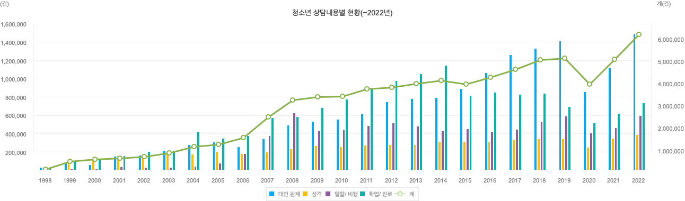

# Empowering-Young-Minds-with-Gemma

## Summary
This project is a chatbot designed to obtain psychological counsel data from children and adolescents, as a result of the Gemma Sprint conducted at the Google ML Bootcamp.

This project uses the advanced language understanding capabilities of the Gemma language model to develop AI for counseling children and adolescents. The AI helps children and adolescents express their thoughts freely without feeling pressure. By providing this support, the AI helps children open up about their worries and thereby gathers counseling data.

## Background

- A significant overall increase in the number of counseling sessions from 1998 to 2022, highlighting growing demand for youth support services.
- From 2010 onward, there’s a consistent rise in total counseling cases, peaking in 2022, suggesting that mental health, interpersonal, and academic concerns are increasingly prioritized among youth.
- Despite fluctuations in individual categories, interpersonal relationship issues (blue bars) have consistently been the highest reported, while emotional problems (yellow bars) have shown steady growth.

## Quick start

### Installation
#### Envrionment
```
pip install -r requirements.txt
```
#### huggingface token
When train or use demo, need to [HuggingFace Token](https://huggingface.co/settings/token) to access model [vvoooo/gemma-2-2b-it-eym-ko](https://huggingface.co/vvoooo/gemma-2-2b-it-eym-ko/)

### Training
#### Envrionments
- CUDA GPU >= 12GB

#### Data
When training a model, we use data in conversational format.
```
{"messages": [{"role": "system", "content": "You are helpful"}, {"role": "user", "content": "What's the capital of France?"}, {"role": "assistant", "content": "..."}]}
{"messages": [{"role": "system", "content": "You are helpful"}, {"role": "user", "content": "Who wrote 'Romeo and Juliet'?"}, {"role": "assistant", "content": "..."}]}
{"messages": [{"role": "system", "content": "You are helpful"}, {"role": "user", "content": "How far is the Moon from Earth?"}, {"role": "assistant", "content": "..."}]}
```
When using ["아동·청소년 상담데이터" in AI-Hub](https://www.aihub.or.kr/aihubdata/data/view.do?currMenu=115&topMenu=100&aihubDataSe=data&dataSetSn=71680), we recommand use [dataset.py](./tools/dataset.py)

#### Train model
Check [finetuning_gemma.ipynb](./finetuning_gemma.ipynb)

### Demo
#### Envrionments
- CUDA GPU >= 2.5GB

#### How to Use
Check [demo.ipynb](./demo.ipynb) in Colab  

or use [demo.py](demo.py)
```
python demo.py
```


## Reference
- [Gemma-2-2b-it](https://huggingface.co/google/gemma-2-2b-it)
- [Gemma 한국어 요약 모델 파인튜닝 빠르게 해보기](https://devocean.sk.com/blog/techBoardDetail.do?ID=165703&boardType=techBlog)
- ["아동·청소년 상담데이터"](https://www.aihub.or.kr/aihubdata/data/view.do?currMenu=115&topMenu=100&aihubDataSe=data&dataSetSn=71680)

This research used datasets from 'The Open AI Dataset Project (AI-Hub, S. Korea)'. All data information can be accessed through 'AI-Hub (www.aihub.or.kr)'.
